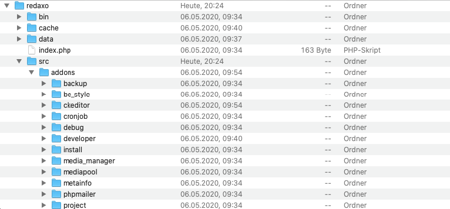

# Verzeichnisstruktur

* [Ordnerstruktur des CMS](#ordnerstruktur)
* [Liste der wichtigsten Pfade samt ihrer Pfad-Variablen](#liste-der-pfade)

## Ordnerstruktur des CMS

In vielen Fällen ist es hilfreich, die Verzeichnisstruktur von REDAXO selbst zu kennen: Wo liegen die Core-Dateien, wo die Klassen und Funktionen, die AddOns und Plugins, wo die Cache-Dateien und die öffentlich erreichbaren Dateien wie die Assets (CSS, JS) von AddOns oder die durch den Redakteur hochgeladenen Dateien?

Einige der Verzeichnisse sind durch htaccess-Dateien vor dem öffentlichen Zugriff geschützt, andere müssen frei erreichbar sein.

> **Hinweis:** Die folgende Tabelle gibt einen groben Überblick; sie ist bewusst nicht vollständig und listet nur die wichtigsten Verzeichnisse aus.

| Pfad | Beschreibung |
| ------------- | ------------- |
| `/redaxo/data/` | der Basisordner für die von einer Website individuell generierten Dateien, z. B. die Konfigurationsdatei config.yml im core-Unterordner |
| `/redaxo/cache/` | Speicherort für alle Cache-Dateien |
| `/redaxo/bin/` | Speicherort für Konsolen-Skripte |
| `/redaxo/src/` | Der Hauptordner (Source) für den Core |
| `/redaxo/src/addons/` | Alle AddOns von REDAXO |
| `/redaxo/src/core/assets/` | Assets für das Backend, im wesentlichen Javascripts |
| `/redaxo/src/core/fragments/` | Die Fragmente enthalten PHP- und HTML-Code und dienen als kleine "Bausteine" dazu, das Backend einheitlich zu gestalten. Sie können auch für die eigene Programmierung verwendet und erweitert werden |
| `/redaxo/src/core/functions/` | Die wesentlichen PHP-Funktionen |
| `/redaxo/src/core/lang/` | Die Sprachdateien für das Backend |
| `/redaxo/src/core/layout/` | Die zwei Dateien in diesem Ordner generieren den Footer, bzw. Header des Backends |
| `/redaxo/src/core/lib/` | Der Kernbereich von REDAXO (Klassen) |
| `/redaxo/src/core/pages/` | Einige zentrale Seiten des Backends, wie z. B. Login, Profil, Setup, etc. |
| `/redaxo/src/core/tests/` | Automatisierte Tests für Core-Klassen und -Funktionen |
| `/redaxo/src/core/vendor/` | Funktionen von externen Bibliotheken, z. B.: Composer, Symfony, etc. |

## Liste der wichtigsten Pfade samt ihrer Pfad-Variablen

Da man bei der eigenen Programmierung – sei es bei eigenen AddOns oder auch bei Modulen und Templates – des Öfteren auf solche Pfade zugreifen muss, gibt es Variablen, die man dafür nutzen kann. Die folgende Tabelle listet die wesentlichen Variablen auf.

> **Hinweis:** Die Liste ist bewusst nicht vollständig und enthält nur die wichtigsten Verzeichnisse.

| Pfad | Beschreibung | Pfad-Variable |
| ------------- | ------------- | ------------- |
| `/` | | `rex_path::frontend($file)` |
| `/index.php` | Einstiegspunkt zum Frontend | `rex_path::frontendController($params)` |
| `/media/` | In den Medienpool geladene Dateien | `rex_path::media($file)` |
| `/assets/` | öffentliche Hilfsdateien | `rex_path::assets($file)` |
| `/assets/addons/addonname/` | öffentliches Hilfsdateien eine AddOns | `rex_path::addonAssets($addon, $file)` |
| `/assets/addons/addonname/plugins/pluginname/` | öffentliches Hilfsdateien eine AddOns | `rex_path::pluginAssets($addon, $plugin, $file)` |
| `/redaxo/` | gesicherter Ordner, kein Zugriff auf die Website von außen außer zur index.php | `rex_path::backend($file)` |
| `/redaxo/index.php` | Einstiegspunkt zum Backend | `rex_path::backendController($params)` |
| `/redaxo/cache/` | Cache-Dateien | `rex_path::cache($file)` |
| `/redaxo/data/` | private Hilfsdateien | `rex_path::data($file)` |
| `/redaxo/data/addons/addonname/` | Private Hilfs- und Backup-Dateien eines AddOns | `rex_path::addonData($addon, $file)` |
| `/redaxo/data/addons/addonname/plugins/pluginname` | Private Hilfs- und Backup-Dateien eines Plugins | `rex_path::pluginData($addon, $plugin, $file)` |
| `/redaxo/src/` | | `rex_path::src($file)` |
| `/redaxo/src/core/` | Core-Dateien | `rex_path::core($file)` |
| `/redaxo/src/addons/addonname/` | | `rex_path::addon($addon, $file)` |
| `/redaxo/src/addons/addonname/pages/` | Seite eines AddOns | `rex_path::addon($addon, 'pages/'.$file)` |
| `/redaxo/src/addons/addonname/lib/` | Klassen und Bibliotheken eines AddOns, mit Autoload-Funktion | `rex_path::addon($addon, 'lib/'.$file)` |
| `/redaxo/src/addons/addonname/vendor/` | Externe Klassen und Bibliotheken, mit Autoload-Funktion | `rex_path::addon($addon, 'vendor/'.$file)` |
| `/redaxo/src/addons/addonname/assets/` | öffentliche Hilfsdateien, sie werden bei der Installation des AddOns in den öffentlichen Ordner kopiert | `rex_path::addon($addon, 'assets/'.$file)` |
| `/redaxo/src/addons/addonname/tests/` | Automatisierte Tests für AddOn-Klassen und -Funktionen | `rex_path::addon($addon, $file).'tests/'` |
| `/redaxo/src/addons/addonname/(un)install.(sql/php)` | Datei zur Installation, bzw. Deinstallation des AddOns | z. B. `rex_path::addon($addon, 'install.php')` |
| `/redaxo/src/addons/addonname/boot.php` | Boot-Datei des AddOns | `rex_path::addon($addon, 'boot.php')` |
| `/redaxo/src/addons/addonname/package.yml` | AddOn-Definitionen wie Version, Autor, einzelne Seiten | `rex_path::addon($addon, 'package.yml')` |
| `/redaxo/src/addons/addonname/plugins/pluginname` | | `rex_path::plugin($addon, $plugin, $file)` |

`$file` und `$params` sind optionale Parameter.
Bei den Pfaden zu Ordnern im öffentlichen Bereich kann statt `rex_path` auch `rex_url` (mit den gleichen Methoden) verwendet werden, um die relative URL statt des absoluten Pfades zu erhalten.
